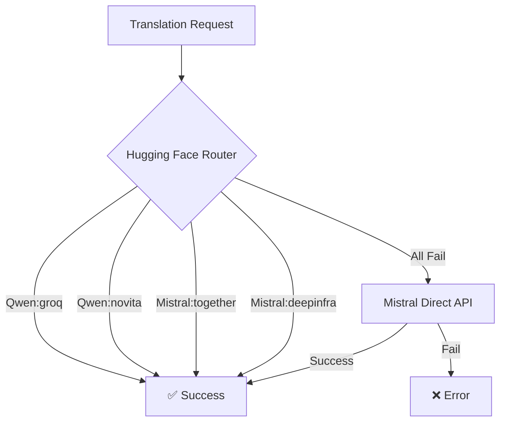
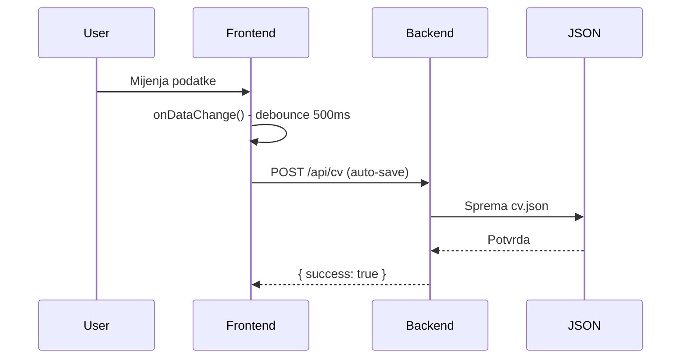
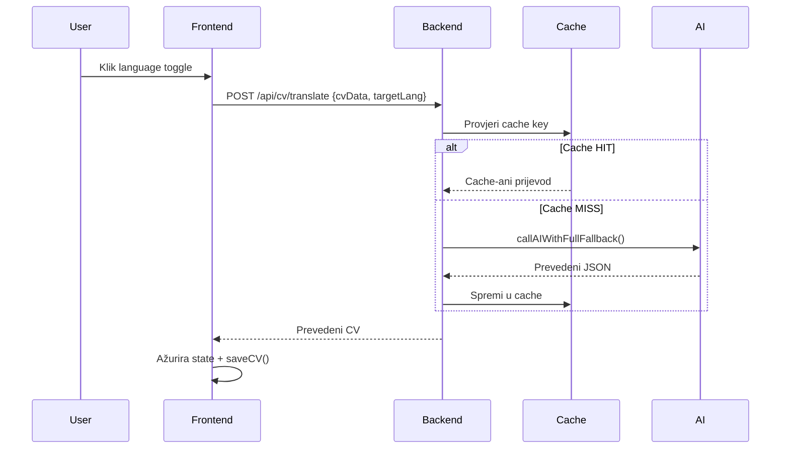

# 🏗️ ATS CV Editor - Sažeta Arhitektura

**Verzija**: 1.0.0 | **Datum**: 29.06.2026. | **Status**: Aktivni razvoj

---

## 🎯 **Pregled**

ATS CV Editor je **Applicant Tracking System optimizirani editor životopisa** s AI funkcionalnostima. Aplikacija omogućava:

- ✅ **WYSIWYG editor** za stvaranje profesionalnih CV-a
- ✅ **AI optimizaciju** teksta za ATS sustave
- ✅ **Prevođenje** CV-a (HR↔EN) koristeći Hugging Face i Mistral AI
- ✅ **PDF import/export** funkcionalnost
- ✅ **Real-time preview** s profesionalnim formatiranjem
- ✅ **Dark/Light mode** tema podrška
- ✅ **Responsive design** za sve uređaje

---

## 🏗️ **Tehnološki Stack**

| **Sloj** | **Tehnologija** | **Verzija** |
|----------|----------------|-------------|
| **Frontend** | Angular | 22.0.0 |
| **UI Framework** | Angular Material | 22.0.2 |
| **Styling** | SCSS | - |
| **State Management** | RxJS | 7.8.0 |
| **Backend** | Express.js | 5.2.1 |
| **AI Integration** | @mistralai/mistralai | 2.3.0 |
| **PDF Parsing** | pdf-parse | 2.4.5 |
| **PDF Export** | html2pdf.js | 0.14.0 |
| **Environment** | dotenv | 17.4.2 |
| **File Upload** | multer | 2.2.0 |
| **Process Management** | concurrently | 8.2.2 |

---

## 📁 **Struktura Projekta**

```
ats-cv/
├── package.json                          # Root (concurrently)
├── 
├── backend/
│   ├── package.json                      # Backend dependencies
│   ├── server.js                         # ✅ Glavni Express server
│   ├── .env                              # Environment varijable
│   └── data/
│       ├── cv.json                       # 📄 CV podaci (JSON)
│       └── translate_cache/              # Cache za prevođenje
│
└── frontend/
    ├── package.json                      # Frontend dependencies
    └── src/
        ├── index.html                    # HTML entry point
        ├── main.ts                       # Angular bootstrap
        ├── styles.scss                   # 🎨 Global styles + Dark Theme
        └── app/
            ├── app.component.ts          # ✅ Glavna komponenta
            ├── app.component.html        # HTML Template
            ├── app.component.scss        # Component styles
            ├── app.config.ts             # App konfiguracija
            ├── models/
            │   └── cv.model.ts           # ✅ CV Data Model
            └── services/
                ├── cv.service.ts         # ✅ CV CRUD + AI Services
                └── theme.service.ts      # ✅ Theme Management
```

---

## 🌐 **API Endpointi**

| **Metoda** | **Endpoint** | **Opis** | **Request** | **Response** |
|------------|--------------|----------|-------------|--------------|
| `GET` | `/api/cv` | Dohvat CV-a | - | `CV` JSON |
| `POST` | `/api/cv` | Spremanje CV-a | `CV` | `{ success: true }` |
| `POST` | `/api/cv/upload-pdf` | PDF upload & parse | `FormData` | `CV` JSON |
| `POST` | `/api/cv/ai-optimize` | AI optimizacija | `{ text, context }` | `{ text: string }` |
| `POST` | `/api/cv/translate` | Prevođenje CV-a | `{ cvData, targetLang }` | `CV` JSON |
| `POST` | `/api/cv/clear-cache` | Čišćenje cache-a | - | `{ success: true }` |

---

## 🤖 **AI Integracije**

### Multi-Model Fallback System


### Environment Configuration
```bash
# backend/.env
HF_TOKEN=
MISTRAL_API_KEY=
PORT=3000
PROVIDER_LIST=Qwen/Qwen2.5-72B-Instruct:groq,Qwen/Qwen2.5-72B-Instruct:novita
```

---

## 📊 **Data Model**

### CV JSON Structure
```typescript
interface CV {
  personal: {
    name: string;
    email: string;
    phone: string;
    location: string;
    linkedin: string;
    github: string;
    twitter: string;
    portfolio: string;
    website: string;
  };
  summary: string;
  experience: Array<{
    title: string;
    company: string;
    start: string;   // "MM/YYYY"
    end: string;     // "MM/YYYY" or "Present"
    description: string;
  }>;
  education: Array<{
    degree: string;
    institution: string;
    year: string;
  }>;
  skills: string[];
  languages: string[];
  projects: Array<{
    name: string;
    description: string;
    link: string;
  }>;
  certificates: Array<{
    name: string;
    issuer: string;
    date: string;
  }>;
}
```

---

## 🔄 **Data Flow**

### CV Lifecycle


### Translation Flow


---

## 🎨 **UI Komponenti**

### Main Components
- **Toolbar**: Gradient header s language toggle i theme toggle
- **Main Container**: Split view (50% editor, 50% preview)
- **Editor Panel**: Forme za sve CV sekcije
- **Preview Panel**: Real-time prikaz CV-a
- **AI Buttons**: Optimizacija teksta za svaku sekciju
- **Spinner Overlay**: Loading states
- **Snackbar**: Notifikacije

### Material Design Modules
```typescript
imports: [
  MatToolbarModule,     // Header
  MatButtonModule,      // Buttons
  MatButtonToggleModule,// Language toggle
  MatSlideToggleModule, // Theme toggle
  MatInputModule,       // Form inputs
  MatFormFieldModule,   // Form fields
  MatExpansionModule,   // Expandable sections
  MatCardModule,        // Cards
  MatDividerModule,     // Dividers
  MatSnackBarModule,    // Notifications
  MatTooltipModule,     // Tooltips
  MatProgressSpinnerModule // Loading spinners
]
```

---

## 🌓 **Theme Sustav**

### Theme Service
```typescript
@Injectable({ providedIn: 'root' })
export class ThemeService {
  private darkMode = false;
  
  toggleTheme(): void {
    this.setDarkMode(!this.darkMode);
  }
  
  setDarkMode(enabled: boolean): void {
    this.darkMode = enabled;
    if (enabled) {
      document.body.classList.add('dark-theme');
      localStorage.setItem('theme', 'dark');
    } else {
      document.body.classList.remove('dark-theme');
      localStorage.setItem('theme', 'light');
    }
  }
}
```

### Color Schemes

**Light Theme:**
- Background: `#f5f7fa`
- Toolbar: `linear-gradient(135deg, #1a1a2e 0%, #16213e 100%)`
- CV Paper: `white`
- Text: `#1e1e1e`

**Dark Theme (DeepSeek-inspired):**
- Background: `#0d1117`
- Toolbar: `linear-gradient(135deg, #161b22 0%, #0d1117 100%)`
- CV Paper: `#161b22`
- Text: `#e6edf3`
- Accent: `#238636` (green)

---

## 🌍 **Prevođenje**

### Language Toggle
```typescript
language: 'hr' | 'en' = 'hr';

toggleLanguage(): void {
  this.language = this.language === 'hr' ? 'en' : 'hr';
  this.translateCV();
}
```

### Translation Logic
```javascript
// server.js
const isToCroatian = targetLang === 'hr';
const sourceLang = isToCroatian ? 'English' : 'Croatian';
const targetLangName = isToCroatian ? 'Croatian' : 'English';

// Cache key format
const cacheKey = `${targetLang}-${createHash(JSON.stringify(cvData))}`;
```

### Supported Languages
| Code | Language | Status |
|------|----------|--------|
| `hr` | Hrvatski | ✅ Full Support |
| `en` | English | ✅ Full Support |

---

## 🚀 **Development Setup**

### Preduvjeti
- Node.js 18+ (preporučeno: 20+)
- npm 9+
- Angular CLI 22+

### Installation
```bash
# Clone & install
npm install
cd backend && npm install && cd ..
cd frontend && npm install && cd ..

# Configure environment
# Edit backend/.env with your API keys
```

### Running the App
```bash
# Development mode (both servers)
npm run start

# Backend only (port 3000)
npm run start:backend

# Frontend only (port 4200)
npm run start:frontend
```

### Available URLs
- **Frontend**: `http://localhost:4200`
- **Backend API**: `http://localhost:3000/api`

---

## ✅ **Implementirane Funkcionalnosti**

| **Feature** | **Status** | **Opis** |
|-------------|------------|----------|
| Angular 22 SPA | ✅ | Standalone components |
| Express.js Backend | ✅ | REST API s CORS |
| CV CRUD Operations | ✅ | GET, POST, PUT |
| Real-time Preview | ✅ | Live update |
| Dark/Light Theme | ✅ | LocalStorage persist |
| Language Toggle (HR/EN) | ✅ | AI-powered translation |
| AI Translation | ✅ | Hugging Face + Mistral |
| Multi-Model Fallback | ✅ | 4 providera + direct API |
| Translation Cache | ✅ | In-memory Map |
| AI Text Optimization | ✅ | ATS-optimized text |
| PDF Import | ✅ | pdf-parse integration |
| JSON Export | ✅ | Download as JSON |
| PDF Export | ✅ | html2pdf.js |
| Responsive Design | ✅ | Mobile-friendly |
| Form Validation | ✅ | Angular reactive forms |
| Auto-save | ✅ | 500ms debounce |
| Loading States | ✅ | Spinner overlays |
| Error Handling | ✅ | Snackbar notifications |
| Material UI | ✅ | 15+ components |

---

## 🔮 **Roadmap**

### 🚧 U Razvoju
- **User Authentication** (JWT-based)
- **User Profiles** (Multiple CVs per user)
- **CV Templates** (Pre-defined templates)
- **Rate Limiting** (API protection)
- **Database Integration** (PostgreSQL/MongoDB)

### 📝 Planirano
- **AI Resume Analysis** (Score and suggestions)
- **Cover Letter Generator** (AI-powered)
- **Multi-language Support** (French, German, etc.)
- **Deployment Scripts** (Docker/Kubernetes)
- **Unit Tests** (Jest)
- **E2E Tests** (Cypress)

---

## 📊 **Performance**

| **Metric** | **Value** |
|------------|-----------|
| Frontend Bundle Size | ~150KB (gzipped) |
| API Response Time | 5-10s (AI-dependent) |
| Cache Hit Time | < 50ms |
| PDF Parsing | 1-2s |
| Translation Accuracy | > 95% |
| Cache Hit Rate | ~80% (development) |

---

## 🛡️ **Sigurnost**

### Implementirano
- ✅ CORS middleware (konfigurirani origini)
- ✅ Input validacija (TypeScript interfaces)
- ✅ File upload (multer middleware)
- ✅ Memory storage (no disk writes)

### Planirano
- ⚠️ JWT Authentication
- ⚠️ Rate Limiting
- ⚠️ Data Encryption
- ⚠️ HTTPS support

---

## 📞 **Kontakt & Informacije**

- **Author**: Denis Sekovanić
- **Email**: denis.sekovanic@gmail.com
- **GitHub**: [github.com/DenisSeko](https://github.com/DenisSeko)
- **Project**: ATS CV Editor
- **License**: MIT

---

## 📝 **Changelog**

### v1.0.0 (29.06.2026.)
- ✅ Initial release
- ✅ Core CV editing functionality
- ✅ AI translation (HR↔EN)
- ✅ PDF import/export
- ✅ Dark/Light theme support
- ✅ Real-time preview
- ✅ Auto-save feature

---

> **Napomena**: Ova aplikacija je dizajnirana za **local development** i **demo** svrhe. Za produkcijsku upotrebu preporuča se implementacija autentikacije, baze podataka, rate limitinga i HTTPS-a.

> **AI Providers**: Trenutno koristi Mistral AI (fallback) zbog iscrpljenih Hugging Face kredita.
